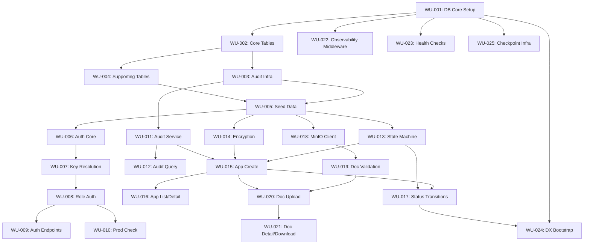

<!-- This project was developed with assistance from AI tools. -->

# Phase 1 Work Breakdown: Foundation + Application Lifecycle

## Summary

**Total Epics:** 6
**Total Stories:** 37 (all P0)
**Total Work Units:** 24
**Total Tasks:** 67
**Estimated Duration:** 12-15 working days (with 3-4 developers working in parallel)

This work breakdown decomposes Phase 1 of the Multi-Agent Mortgage Loan Processing System into epics, stories, work units, and implementation tasks. Phase 1 delivers the foundational infrastructure: authentication, audit trail, PII protection, database schema, application lifecycle CRUD, document management, observability, health checks, and developer experience tooling.

All tasks are written as agent prompts with concrete file paths, machine-verifiable exit conditions, and explicit context. Task sizing follows the constraints in `.claude/rules/agent-workflow.md`: 3-5 files per task, ~1 hour autonomous execution, single concern, machine-verifiable completion.

---

## Epic Breakdown

| Epic | Stories | Work Units | Tasks | Estimated Days |
|------|---------|------------|-------|----------------|
| E-001: Database Foundation | 4 (implicit) | 5 | 12 | 3-4 |
| E-002: Authentication & Authorization | 8 | 5 | 11 | 2-3 |
| E-003: Audit Infrastructure | 4 | 3 | 8 | 2-3 |
| E-004: Application Lifecycle | 7 | 5 | 14 | 3-4 |
| E-005: Document Management | 4 | 3 | 10 | 2-3 |
| E-006: Observability & Developer Experience | 10 | 3 | 12 | 2-3 |

---

## E-001: Database Foundation

**Goal:** Establish the PostgreSQL database schema, migrations, and seed data required by all other Phase 1 features.

**PRD Reference:** plans/product/PRD-mortgage-system.md (Foundation phase)
**Priority:** P0
**Milestone:** Phase 1
**Estimated Size:** XL

### Stories

- Implicit: Database schema design (DDL delivered via TD)
- Implicit: Alembic migration setup
- DX-01: Seed Data Loading
- DX-02: One-Command Local Development (database portion)

### Acceptance Criteria (Epic-Level)

- [ ] All Phase 1 tables exist with correct schema (api_keys, loan_applications, documents, audit_events, confidence_thresholds)
- [ ] Alembic migrations apply cleanly from empty database to full Phase 1 schema
- [ ] Seed data is idempotent and reproducible
- [ ] 3 API keys (loan_officer, senior_underwriter, reviewer) seeded with 24-hour TTL
- [ ] 12 test applications seeded with complete audit trails
- [ ] Default confidence thresholds seeded

### Dependencies

- **Depends on:** None (foundational)
- **Blocks:** All other epics

---

## WU-001: Database Core Setup

**Story:** Database Foundation (implicit)
**Tasks:** T-001, T-002, T-003
**Agent:** @database-engineer

### Shared Context

**Read these files first:**
- `plans/technical-design-phase-1.md`, Section "Database Schema" (lines 770-1001) — Complete DDL for all Phase 1 tables
- `packages/db/src/database.py` (if exists; create if not) — Async engine and session factory

**Key design decisions:**
- SQLAlchemy 2.0 async throughout
- BIGINT for monetary cents columns (supports loans > $21.4M)
- `autocommit=False` (default) required for `SET LOCAL ROLE` in audit service
- Connection pooling: separate pools for app_user and langgraph schema access

**Scope boundaries:**
- Covers: Extensions, connection setup, base model class
- Excludes: Individual table models (those are in WU-002 through WU-005)

### Tasks

See Task section below for T-001, T-002, T-003

---

## WU-002: Core Table Migrations

**Story:** Database Foundation (implicit)
**Tasks:** T-004, T-005, T-006
**Agent:** @database-engineer

### Shared Context

**Read these files first:**
- `plans/technical-design-phase-1.md`, Section "Database Schema" — Full DDL
- `packages/db/src/migrations/env.py` — Alembic environment (created in T-002)

**Key design decisions:**
- Migration order follows foreign key dependencies: api_keys → loan_applications → documents → audit_events
- Use `op.execute()` for raw SQL DDL (CREATE TABLE, CREATE INDEX)
- Down migrations must reverse in dependency order

**Scope boundaries:**
- Covers: api_keys, loan_applications, documents tables
- Excludes: audit_events (WU-003), confidence_thresholds (WU-004), langgraph schema (WU-005)

### Tasks

See T-004, T-005, T-006 below

---

## WU-003: Audit Infrastructure Migrations

**Story:** AUDIT-01, AUDIT-02, AUDIT-03 (partial — database portion)
**Tasks:** T-007, T-008
**Agent:** @database-engineer

### Shared Context

**Read these files first:**
- `plans/technical-design-phase-1.md`, Section "Audit Event Immutability: Trigger Guard" (lines 925-939)
- `plans/technical-design-phase-1.md`, Section "Audit Event Immutability: INSERT-Only Role" (lines 941-952)
- `plans/advisory/work-breakdown-phase-1-complexity-database-engineer.md` — Complexity assessment for audit immutability

**Key design decisions:**
- Three-layer immutability: INSERT-only role + trigger guard + hash chain (hash chain logic is service-layer, not DB)
- `SET LOCAL ROLE audit_writer` requires transaction context — document in migration comments
- Trigger fires BEFORE UPDATE/DELETE, raising exception to block operation
- Role has GRANT to app_user so connection pool can `SET ROLE`

**Scope boundaries:**
- Covers: audit_events table, trigger function + attachment, audit_writer role + grants
- Excludes: Hash chain computation (that's in AuditService, WU-011)

### Tasks

See T-007, T-008 below

---

## WU-004: Supporting Tables

**Story:** Database Foundation (implicit), THRESHOLD-01/02 (schema only)
**Tasks:** T-009, T-010
**Agent:** @database-engineer

### Shared Context

**Read these files first:**
- `plans/technical-design-phase-1.md`, Section "confidence_thresholds" (lines 957-974)
- `plans/technical-design-phase-1.md`, Section "langgraph schema" (lines 979-984)

**Key design decisions:**
- `confidence_thresholds` table exists in Phase 1 but has no API surface until Phase 5
- Seeded with defaults: auto_approve_min=0.85, escalate_below=0.60
- `langgraph` schema is created but tables within are managed by PostgresSaver.setup()

**Scope boundaries:**
- Covers: confidence_thresholds table, langgraph schema creation
- Excludes: Threshold management endpoints (Phase 5)

### Tasks

See T-009, T-010 below

---

## WU-005: Seed Data Generation

**Story:** DX-01 (Seed Data Loading), DX-02 (partial)
**Tasks:** T-011, T-012, T-013
**Agent:** @database-engineer

### Shared Context

**Read these files first:**
- `plans/technical-design-phase-1.md`, Section "Seed Data Specification" (lines 1002-1045)
- `plans/advisory/work-breakdown-phase-1-complexity-database-engineer.md`, Section "Migration 009: Seed Data" — Complexity details

**Key design decisions:**
- Seed data is an Alembic data migration (not a separate script)
- Idempotent: checks for existence before inserting (INSERT ... ON CONFLICT DO NOTHING or manual check)
- Fixed UUIDs for reproducibility
- Plaintext API keys printed to console during migration (not logged to file)
- Encryption and HMAC logic must be available in migration (import from services or duplicate)

**Scope boundaries:**
- Covers: 3 API keys, 12 applications with encrypted PII, documents, complete audit trails, default thresholds
- Excludes: Knowledge base content (Phase 5)

### Tasks

See T-011, T-012, T-013 below

---

## E-002: Authentication & Authorization

**Goal:** Implement API key authentication (HMAC-SHA256), role-based access control, key lifecycle management, and production credential validation.

**PRD Reference:** plans/requirements-chunk-1-foundation.md (AUTH stories)
**Priority:** P0
**Milestone:** Phase 1
**Estimated Size:** L

### Stories

- AUTH-01: Require Authentication for All Protected Endpoints
- AUTH-02: Provision API Keys
- AUTH-03: Revoke API Keys
- AUTH-04: List Active API Keys
- AUTH-05: Role-Based Access Control
- AUTH-06: Role Hierarchy
- AUTH-07: Seed Key Bootstrapping (covered by DX-01)
- AUTH-08: API Key Expiration

### Acceptance Criteria (Epic-Level)

- [ ] All protected endpoints enforce authentication via middleware
- [ ] Invalid/expired/revoked keys return 401 with identical responses (no info leakage)
- [ ] Role hierarchy enforced: loan_officer < senior_underwriter < reviewer
- [ ] API key CRUD endpoints functional (/v1/auth/keys)
- [ ] Production mode refuses to start with default credentials
- [ ] Auth failures generate audit events

### Dependencies

- **Depends on:** E-001 (Database Foundation) — api_keys table must exist
- **Blocks:** E-003, E-004, E-005 (all require auth)

---

## WU-006: Auth Core Infrastructure

**Story:** AUTH-01, AUTH-05, AUTH-06 (partial — context and roles)
**Tasks:** T-014, T-015
**Agent:** @backend-developer

### Shared Context

**Read these files first:**
- `plans/technical-design-phase-1.md`, Section "Auth Context" (lines 164-175)
- `plans/technical-design-phase-1.md`, Section "Role Hierarchy" (lines 177-196)

**Key design decisions:**
- `AuthContext` is a frozen dataclass (immutable)
- Role hierarchy uses IntEnum for comparison
- `meets_minimum_role()` compares integer values
- Client-supplied role prefix (Bearer role:key) is ignored for authorization

**Scope boundaries:**
- Covers: AuthContext dataclass, Role enum, ROLE_HIERARCHY dict, meets_minimum_role() function
- Excludes: Key resolution middleware (WU-007), require_role dependency (WU-008)

### Tasks

See T-014, T-015 below

---

## WU-007: Key Resolution Middleware

**Story:** AUTH-01, AUTH-06, AUTH-08 (key validation, expiration)
**Tasks:** T-016, T-017
**Agent:** @backend-developer

### Shared Context

**Read these files first:**
- `plans/technical-design-phase-1.md`, Section "Key Resolution Flow" (lines 1191-1255)
- `packages/api/src/auth/context.py` — AuthContext (created in T-014)
- `packages/api/src/auth/roles.py` — Role hierarchy (created in T-015)

**Key design decisions:**
- HMAC-SHA256 hash computed on every request (no caching)
- Database lookup by hash (indexed, constant-time)
- Expiration checked after lookup
- Auth failures call audit service (dependency on WU-011)
- Role mismatch logged as warning (not error)

**Scope boundaries:**
- Covers: resolve_api_key FastAPI dependency, HMAC computation, DB lookup, expiration check
- Excludes: Audit service implementation (WU-011 provides interface)

### Tasks

See T-016, T-017 below

---

## WU-008: Role Authorization Dependency

**Story:** AUTH-05, AUTH-06 (role gates on endpoints)
**Tasks:** T-018
**Agent:** @backend-developer

### Shared Context

**Read these files first:**
- `plans/technical-design-phase-1.md`, Section "Role Authorization Dependency" (lines 1258-1278)
- `packages/api/src/auth/resolver.py` — resolve_api_key (created in T-016)
- `packages/api/src/auth/roles.py` — meets_minimum_role (created in T-015)

**Key design decisions:**
- `require_role(minimum)` returns a FastAPI dependency
- Uses `Depends(resolve_api_key)` internally
- Raises AuthorizationError (403) on insufficient role
- Applied via `dependencies=[Depends(require_role("reviewer"))]` on routes

**Scope boundaries:**
- Covers: require_role dependency factory
- Excludes: Applying it to specific routes (done per route handler in E-004, E-005)

### Tasks

See T-018 below

---

## WU-009: API Key Management Endpoints

**Story:** AUTH-02, AUTH-03, AUTH-04
**Tasks:** T-019, T-020, T-021
**Agent:** @backend-developer

### Shared Context

**Read these files first:**
- `plans/technical-design-phase-1.md`, Section "POST /v1/auth/keys" (lines 576-612)
- `plans/technical-design-phase-1.md`, Section "GET /v1/auth/keys" (lines 614-640)
- `plans/technical-design-phase-1.md`, Section "DELETE /v1/auth/keys/:id" (lines 642-650)

**Key design decisions:**
- POST returns plaintext key ONLY in creation response (never again)
- DELETE is soft delete (sets is_active=false), idempotent
- Self-revocation (caller revokes own key) returns 409
- All require reviewer role

**Scope boundaries:**
- Covers: /v1/auth/keys POST, GET, DELETE endpoints with role gates
- Excludes: Auth middleware (already in WU-007)

### Tasks

See T-019, T-020, T-021 below

---

## WU-010: Production Credential Check

**Story:** AUTH-07 (Production Credential Validation)
**Tasks:** T-022
**Agent:** @backend-developer

### Shared Context

**Read these files first:**
- `plans/technical-design-phase-1.md`, Section "Production Credential Check" (lines 1282-1327)

**Key design decisions:**
- Runs at application startup, before HTTP server listens
- Only in production mode (ENVIRONMENT=production)
- Checks: seed keys in DB, default MinIO creds, default PG password, Redis no-auth, missing secrets
- Exits with code 1 if any check fails

**Scope boundaries:**
- Covers: Startup check function, integration with FastAPI lifespan
- Excludes: Fixing the credentials (that's operational, not code)

### Tasks

See T-022 below

---

## E-003: Audit Infrastructure

**Goal:** Implement the immutable, hash-chained audit trail for state transitions, agent decisions, and auth events.

**PRD Reference:** plans/requirements-chunk-1-foundation.md (AUDIT stories)
**Priority:** P0
**Milestone:** Phase 1
**Estimated Size:** M

### Stories

- AUDIT-01: State Transition Events
- AUDIT-02: Agent Decision Events
- AUDIT-03: Audit Event Immutability
- AUDIT-04: Query Audit Events for an Application

### Acceptance Criteria (Epic-Level)

- [ ] All state transitions generate audit events
- [ ] All agent decisions generate audit events (Phase 2+)
- [ ] Audit events are append-only (UPDATE/DELETE blocked by trigger)
- [ ] Hash chain integrity enforced (each event references previous)
- [ ] Audit event querying with filtering and pagination works
- [ ] `SET ROLE audit_writer` mechanism works for INSERT-only permissions

### Dependencies

- **Depends on:** E-001 (Database Foundation) — audit_events table and trigger/role setup
- **Blocks:** E-004 (Application Lifecycle) — state transitions require audit service

---

## WU-011: Audit Service Core

**Story:** AUDIT-01, AUDIT-02, AUDIT-03 (service implementation)
**Tasks:** T-023, T-024
**Agent:** @backend-developer

### Shared Context

**Read these files first:**
- `plans/technical-design-phase-1.md`, Section "Core Audit Service" (lines 1398-1526)
- `plans/advisory/work-breakdown-phase-1-complexity-database-engineer.md`, Section "Advisory Lock + Connection Pooling" and "SET LOCAL ROLE and Async Sessions"

**Key design decisions:**
- Advisory lock per application_id serializes concurrent audit writes
- `pg_advisory_xact_lock` (transaction-scoped, releases on commit/rollback)
- Hash chain: SHA-256 of concatenated fields (id, application_id, event_type, created_at, prev_event_hash)
- Null sentinel for first event: "0" * 64
- `SET LOCAL ROLE audit_writer` before INSERT, `RESET ROLE` after
- Requires session to be in transaction (autocommit=False)

**Scope boundaries:**
- Covers: AuditService.record_event() core method, hash computation, advisory lock, SET ROLE
- Excludes: Convenience methods (T-024), audit query endpoint (WU-012)

### Tasks

See T-023, T-024 below

---

## WU-012: Audit Event Querying

**Story:** AUDIT-04 (Query Audit Events for an Application)
**Tasks:** T-025
**Agent:** @backend-developer

### Shared Context

**Read these files first:**
- `plans/technical-design-phase-1.md`, Section "GET /v1/applications/:id/audit-events" (lines 652-708)
- `packages/api/src/services/audit.py` — AuditService (created in T-023)

**Key design decisions:**
- Cursor pagination using base64-encoded event id (BIGSERIAL, monotonically increasing)
- Order: chronological (oldest first, id ASC)
- Filters: eventType, dateFrom, dateTo (all optional)
- Default limit: 50, max: 200
- RBAC: loan_officer sees only own applications, senior_underwriter+ sees all

**Scope boundaries:**
- Covers: GET /v1/applications/:id/audit-events endpoint with filtering and pagination
- Excludes: Audit export (Phase 4), hash chain validation (Phase 4)

### Tasks

See T-025 below

---

## E-004: Application Lifecycle

**Goal:** Implement application CRUD, status state machine, submission workflow, and retry mechanism.

**PRD Reference:** plans/requirements-chunk-2-core-workflow.md (APP stories)
**Priority:** P0
**Milestone:** Phase 1
**Estimated Size:** XL

### Stories

- APP-01: Create a New Loan Application
- APP-02: List All Applications with Current Status
- APP-03: View Single Application Details
- APP-04: Submit a Draft Application for Processing
- APP-05: Application Status Transitions
- APP-06: Withdraw an Application
- APP-07: Retry a Failed Application

### Acceptance Criteria (Epic-Level)

- [ ] Applications can be created with all required borrower/loan data
- [ ] PII (SSN, account numbers, government ID) is encrypted at rest
- [ ] SSN displayed as masked (***-**-1234) in responses
- [ ] Applications list with pagination and status filtering
- [ ] Application detail includes all fields + related documents
- [ ] Status transitions enforce state machine rules (invalid transitions return 409)
- [ ] Submission requires at least one document and triggers double transition (draft -> submitted -> processing)
- [ ] Workflow invocation enqueued (stub in Phase 1, real in Phase 2)
- [ ] Withdraw transition respects terminal state constraints
- [ ] Retry from processing_error transitions back to processing

### Dependencies

- **Depends on:** E-001 (Database), E-002 (Auth), E-003 (Audit), PII encryption service (WU-014)
- **Blocks:** E-005 (Documents depend on applications)

---

## WU-013: Status State Machine

**Story:** APP-05 (Status Transitions), APP-06, APP-07 (partial)
**Tasks:** T-026
**Agent:** @backend-developer

### Shared Context

**Read these files first:**
- `plans/technical-design-phase-1.md`, Section "Application Status State Machine" (lines 199-228)

**Key design decisions:**
- ApplicationStatus is StrEnum (string-based enum for JSON serialization)
- VALID_TRANSITIONS dict defines allowed from->to mappings
- TERMINAL_STATES set: approved, denied, withdrawn (no transitions out)
- is_valid_transition() function checks dict + terminal state guard

**Scope boundaries:**
- Covers: ApplicationStatus enum, VALID_TRANSITIONS, TERMINAL_STATES, is_valid_transition()
- Excludes: Using it in route handlers (done in WU-015, WU-016, WU-017)

### Tasks

See T-026 below

---

## WU-014: PII Encryption Service

**Story:** PII-01, PII-04 (encryption), PII-02 (masking logic)
**Tasks:** T-027, T-028
**Agent:** @backend-developer

### Shared Context

**Read these files first:**
- `plans/technical-design-phase-1.md`, Section "Encryption Service" (lines 1333-1382)

**Key design decisions:**
- Fernet symmetric encryption (AES-128-CBC + HMAC-SHA256)
- Key version byte prepended before ciphertext: \x01 = current, \x00 = previous
- Dual-key rotation: ENCRYPTION_KEY (current) + ENCRYPTION_KEY_PREVIOUS (optional)
- extract_last4() helper for SSN masking
- mask_ssn() formats as ***-**-NNNN

**Scope boundaries:**
- Covers: EncryptionService class (encrypt, decrypt, extract_last4, mask_ssn)
- Excludes: Using it in application routes (done in WU-015)

### Tasks

See T-027, T-028 below

---

## WU-015: Application Create Endpoint

**Story:** APP-01 (Create Application)
**Tasks:** T-029, T-030
**Agent:** @backend-developer

### Shared Context

**Read these files first:**
- `plans/technical-design-phase-1.md`, Section "POST /v1/applications" (lines 246-306 request, 307-389 response)
- `plans/technical-design-phase-1.md`, Section "Application Creation (APP-01)" data flow (lines 44-60)
- `packages/api/src/services/encryption.py` — EncryptionService (created in T-027)
- `packages/api/src/services/audit.py` — AuditService (created in T-023)

**Key design decisions:**
- Monetary values validated as positive decimals (string format)
- SSN validated via regex pattern (NNN-NN-NNNN)
- SSN encrypted with Fernet, last 4 extracted before encryption
- Account numbers and government ID encrypted if present
- Audit event: state_transition (null -> draft)
- Returns 201 with Location header

**Scope boundaries:**
- Covers: POST /v1/applications endpoint with validation, encryption, DB insert, audit, response serialization
- Excludes: List/detail endpoints (WU-016), status transitions (WU-017)

### Tasks

See T-029, T-030 below

---

## WU-016: Application List and Detail Endpoints

**Story:** APP-02 (List Applications), APP-03 (View Details)
**Tasks:** T-031, T-032
**Agent:** @backend-developer

### Shared Context

**Read these files first:**
- `plans/technical-design-phase-1.md`, Section "GET /v1/applications" (lines 391-433)
- `plans/technical-design-phase-1.md`, Section "GET /v1/applications/:id" (lines 435-477)
- `packages/api/src/models/responses.py` — ApplicationResponse, ApplicationListItem (created in T-030)

**Key design decisions:**
- List: cursor pagination via base64(created_at:id), default limit 20, max 100, order by created_at DESC
- List: RBAC — loan_officer sees only created_by=self, senior_underwriter+ sees all
- Detail: includes documents (embedded array), analyses=null in Phase 1
- Detail: RBAC — loan_officer who didn't create returns 404 (not 403, prevents info leakage)
- Non-UUID id returns 400, nonexistent UUID returns 404

**Scope boundaries:**
- Covers: GET /v1/applications (list with pagination/filtering) and GET /v1/applications/:id (detail)
- Excludes: Status transition endpoints (WU-017)

### Tasks

See T-031, T-032 below

---

## WU-017: Application Status Transition Endpoints

**Story:** APP-04 (Submit), APP-05 (generic transitions), APP-06 (Withdraw), APP-07 (Retry)
**Tasks:** T-033, T-034, T-035
**Agent:** @backend-developer

### Shared Context

**Read these files first:**
- `plans/technical-design-phase-1.md`, Section "PATCH /v1/applications/:id" (lines 479-499)
- `plans/technical-design-phase-1.md`, Section "POST /v1/applications/:id/retry" (lines 501-519)
- `plans/technical-design-phase-1.md`, Section "Application Submission (APP-04)" data flow (lines 85-102)
- `packages/api/src/models/status.py` — State machine (created in T-026)

**Key design decisions:**
- Submit (draft -> submitted): requires at least one document, triggers double transition (submitted -> processing), enqueues workflow stub
- Withdraw: allowed from draft, submitted, awaiting_review; returns 409 from processing or terminal states
- Retry: allowed only from processing_error, transitions back to processing, re-enqueues workflow
- Invalid transitions return 409 with descriptive detail
- Each transition generates audit event

**Scope boundaries:**
- Covers: PATCH /v1/applications/:id (status transitions) and POST /v1/applications/:id/retry
- Excludes: Real workflow execution (stub in Phase 1, real in Phase 2)

### Tasks

See T-033, T-034, T-035 below

---

## E-005: Document Management

**Goal:** Implement document upload/download with validation, MinIO storage, and processing status tracking.

**PRD Reference:** plans/requirements-chunk-2-core-workflow.md (DOC stories)
**Priority:** P0
**Milestone:** Phase 1
**Estimated Size:** L

### Stories

- DOC-01: Upload Supporting Documents
- DOC-02: Document Validation on Upload
- DOC-03: Download a Document
- DOC-04: List Documents for an Application

### Acceptance Criteria (Epic-Level)

- [ ] Documents can be uploaded to draft applications only
- [ ] File validation: magic bytes (not Content-Type header), MIME allowlist (PDF, JPEG, PNG, TIFF), max 20MB
- [ ] PDF structure validation and image header validation prevent polyglot attacks
- [ ] Filename sanitization (strip path, replace non-alnum, truncate 255)
- [ ] Storage key is UUID (never original filename)
- [ ] MinIO SSE encryption for all stored objects
- [ ] Document metadata persisted in documents table
- [ ] Document download returns binary content with correct Content-Type and Content-Disposition
- [ ] Document list returns all documents for an application

### Dependencies

- **Depends on:** E-001 (Database), E-002 (Auth), E-003 (Audit), E-004 (Applications must exist)
- **Blocks:** None (Phase 2 pipeline consumes documents)

---

## WU-018: MinIO Client Service

**Story:** DOC-01, DOC-03 (storage operations)
**Tasks:** T-036
**Agent:** @backend-developer

### Shared Context

**Read these files first:**
- `plans/technical-design-phase-1.md`, Section "Configuration" (lines 1676-1718) — MinIO settings
- `plans/advisory/work-breakdown-phase-1-complexity-devops-engineer.md`, Section "MinIO bucket initialization"

**Key design decisions:**
- Bucket created at startup if not exists (check-and-create pattern)
- All uploads use server-side encryption (SSE)
- Storage keys are UUIDs (generated by caller, not MinIO)
- Client wraps minio-py async methods

**Scope boundaries:**
- Covers: MinioClient wrapper with upload_file, download_file, ensure_bucket_exists methods
- Excludes: Document validation (WU-019), route handlers (WU-020, WU-021)

### Tasks

See T-036 below

---

## WU-019: Document Validation Service

**Story:** DOC-02 (validation logic)
**Tasks:** T-037, T-038
**Agent:** @backend-developer

### Shared Context

**Read these files first:**
- `plans/technical-design-phase-1.md`, Section "Document Upload (DOC-01, DOC-02)" data flow (lines 63-82)
- `plans/advisory/work-breakdown-phase-1-complexity-backend-developer.md`, Section "Python-magic file type detection"

**Key design decisions:**
- Magic byte validation via python-magic library (not Content-Type header trust)
- MIME allowlist: application/pdf, image/jpeg, image/png, image/tiff
- PDF structure validation (basic: check %PDF header, %%EOF trailer, no embedded executables)
- Image header validation (JPEG/PNG/TIFF magic bytes)
- Max file size: 20MB (20,971,520 bytes)
- Filename sanitization: strip path components, replace non-alnum except . and -, truncate 255 chars

**Scope boundaries:**
- Covers: DocumentValidator class with validate_file method (MIME, size, structure)
- Excludes: Upload endpoint (WU-020)

### Tasks

See T-037, T-038 below

---

## WU-020: Document Upload Endpoint

**Story:** DOC-01, DOC-02 (upload endpoint)
**Tasks:** T-039, T-040
**Agent:** @backend-developer

### Shared Context

**Read these files first:**
- `plans/technical-design-phase-1.md`, Section "POST /v1/applications/:id/documents" (lines 520-558)
- `packages/api/src/services/minio_client.py` — MinioClient (created in T-036)
- `packages/api/src/services/document.py` — DocumentValidator (created in T-037)

**Key design decisions:**
- Multipart/form-data with field name "document"
- Requires loan_officer+ role
- Requires application status = draft (Phase 4 adds awaiting_documents)
- Ownership check: loan_officer must be created_by, senior_underwriter+ can upload to any
- File validation before upload (fail-fast on invalid file)
- UUID storage key generated by endpoint
- Audit event: document_upload
- Returns 201 with Location header

**Scope boundaries:**
- Covers: POST /v1/applications/:id/documents endpoint
- Excludes: Document detail/download (WU-021)

### Tasks

See T-039, T-040 below

---

## WU-021: Document Detail and Download Endpoints

**Story:** DOC-03 (detail and download), DOC-04 (list)
**Tasks:** T-041, T-042
**Agent:** @backend-developer

### Shared Context

**Read these files first:**
- `plans/technical-design-phase-1.md`, Section "GET /v1/documents/:id" (lines 560-569)
- `plans/technical-design-phase-1.md`, Section "GET /v1/documents/:id/download" (lines 571-575)
- `plans/technical-design-phase-1.md`, Section "GET /v1/applications/:id/documents" (lines 560-564)

**Key design decisions:**
- Document detail: requires auth, RBAC via parent application ownership
- Document download: streams binary content from MinIO, Content-Disposition=attachment
- Document list: returns all documents for an application, ordered by created_at DESC

**Scope boundaries:**
- Covers: GET /v1/documents/:id, GET /v1/documents/:id/download, GET /v1/applications/:id/documents
- Excludes: Upload (WU-020)

### Tasks

See T-041, T-042 below

---

## E-006: Observability & Developer Experience

**Goal:** Implement correlation IDs, structured logging, health checks, seed data, OpenAPI docs, and local development tooling.

**PRD Reference:** plans/requirements-chunk-1-foundation.md (OBS, DX, DEPLOY-03 stories)
**Priority:** P0
**Milestone:** Phase 1
**Estimated Size:** L

### Stories

- OBS-01: Correlation ID Generation
- OBS-02: Correlation ID Propagation
- OBS-03: Structured Logging
- DX-01: Seed Data Loading (already in E-001)
- DX-02: One-Command Local Development
- DX-03: API Documentation (OpenAPI)
- DX-04: Architecture Documentation
- DEPLOY-03: Health Check Endpoints
- CHECKPOINT-01: Save Workflow State After Each Agent (infrastructure)
- CHECKPOINT-02: Resume Workflow from Last Checkpoint (infrastructure)
- CHECKPOINT-03: Checkpoint Cleanup

### Acceptance Criteria (Epic-Level)

- [ ] Every request has a unique correlation ID (X-Request-ID header)
- [ ] Correlation ID propagates through all log entries and audit events
- [ ] Logs are structured JSON with required fields (timestamp, level, message, correlationId, service)
- [ ] PII masked in logs
- [ ] /health endpoint returns 200 if process is alive
- [ ] /ready endpoint checks dependencies (PostgreSQL, Redis, MinIO)
- [ ] make setup && make dev brings up fully functional local environment
- [ ] Seed data loads 3 API keys, 12 applications, documents, audit trails, thresholds
- [ ] /docs serves Swagger UI with all Phase 1 endpoints
- [ ] README contains architecture overview

### Dependencies

- **Depends on:** E-001 (Database for seed data and health checks)
- **Blocks:** None (cross-cutting)

---

## WU-022: Observability Middleware

**Story:** OBS-01, OBS-02, OBS-03 (middleware)
**Tasks:** T-043, T-044, T-045
**Agent:** @backend-developer

### Shared Context

**Read these files first:**
- `plans/technical-design-phase-1.md`, Section "Correlation ID Middleware" (lines 1126-1158)
- `plans/technical-design-phase-1.md`, Section "Structured Logging" (lines 1160-1185)

**Key design decisions:**
- Correlation middleware runs FIRST (before auth) so all requests are traceable
- X-Request-ID: accept from client if valid (alnum, <=128 chars), else generate UUID
- Echo correlation ID in response header
- Attach to request.state.correlation_id
- structlog for JSON logging with PII-aware processor
- Log fields: timestamp, level, message, correlationId, service, contextual fields
- PII filter: mask ssn*, account_number*, government_id*, authorization header

**Scope boundaries:**
- Covers: CorrelationIdMiddleware, structured logging setup, PII filter processor
- Excludes: Health endpoints (WU-023), request logging middleware (T-045)

### Tasks

See T-043, T-044, T-045 below

---

## WU-023: Health Check Endpoints

**Story:** DEPLOY-03 (health and readiness)
**Tasks:** T-046
**Agent:** @backend-developer

### Shared Context

**Read these files first:**
- `plans/technical-design-phase-1.md`, Section "GET /health" and "GET /ready" (lines 710-747)

**Key design decisions:**
- /health: no auth, returns 200 {"status": "ok"} if process is alive
- /ready: no auth, checks PostgreSQL (SELECT 1), Redis (PING), MinIO (list_buckets or HEAD)
- /ready: returns 200 if all dependencies healthy, 503 if any unhealthy
- /ready: response includes dependency status details
- Lightweight checks (no heavy queries)

**Scope boundaries:**
- Covers: GET /health and GET /ready endpoints
- Excludes: API startup health (T-050)

### Tasks

See T-046 below

---

## WU-024: Developer Experience Bootstrap

**Story:** DX-02 (One-Command Local Development), DX-03 (OpenAPI), DX-04 (Architecture Docs)
**Tasks:** T-047, T-048, T-049, T-050
**Agent:** @devops-engineer (T-047), @backend-developer (T-048, T-050), @technical-writer (T-049)

### Shared Context

**Read these files first:**
- `plans/technical-design-phase-1.md`, Section "File/Module Structure" (lines 1722-1827)
- `plans/advisory/work-breakdown-phase-1-complexity-devops-engineer.md` — Bootstrap ordering and risks

**Key design decisions:**
- compose.yml: PostgreSQL with POSTGRES_DB=mortgage_app, Redis, MinIO
- PostgreSQL init script for uuid-ossp extension
- MinIO bucket auto-created by API on startup (not compose)
- Named volumes for data persistence across restarts
- Makefile: setup, db-start, db-upgrade, dev targets
- API startup: retry DB connection (10 retries, 3s delay), run migrations, check credentials
- OpenAPI: FastAPI auto-generates, accessible at /docs
- README: architecture overview, system diagram, command reference

**Scope boundaries:**
- Covers: compose.yml, Makefile, API startup checks, OpenAPI config, README architecture section
- Excludes: Seed data (already in WU-005), frontend (Phase 6)

### Tasks

See T-047, T-048, T-049, T-050 below

---

## WU-025: Checkpoint Infrastructure

**Story:** CHECKPOINT-01, CHECKPOINT-02, CHECKPOINT-03
**Tasks:** T-051, T-052
**Agent:** @backend-developer

### Shared Context

**Read these files first:**
- `plans/technical-design-phase-1.md`, Section "PostgresSaver Configuration" (lines 1575-1587)
- `plans/technical-design-phase-1.md`, Section "Stub Graph for Phase 1" (lines 1588-1620)
- `plans/technical-design-phase-1.md`, Section "Checkpoint Cleanup" (lines 1648-1672)

**Key design decisions:**
- PostgresSaver uses langgraph schema (separate from public)
- Thread ID = str(application_id) for first pass
- LoanProcessingState TypedDict with all required fields
- Phase 1 stub: single node that sets current_step="stub_complete"
- Cleanup: daily task deletes checkpoints for terminal apps older than 30 days

**Scope boundaries:**
- Covers: PostgresSaver setup, LoanProcessingState definition, stub graph, cleanup task
- Excludes: Real agent nodes (Phase 2)

### Tasks

See T-051, T-052 below

---

## Task Inventory

### T-001: PostgreSQL Extensions and Database Setup
**Work Unit:** WU-001
**Agent:** @database-engineer
**Estimate:** S

#### Agent Prompt

**1. Read these files:**
- `plans/technical-design-phase-1.md`, lines 770-1001 (Database Schema section)

**2. Do these steps:**
1. Create migration `packages/db/src/migrations/versions/001_create_extensions.py`
2. Add upgrade operation: `op.execute('CREATE EXTENSION IF NOT EXISTS "uuid-ossp"')`
3. Add downgrade operation: `op.execute('DROP EXTENSION IF EXISTS "uuid-ossp"')`
4. Migration docstring: "Create uuid-ossp extension for gen_random_uuid()"

**3. Verify:**
- [ ] `cd packages/db && alembic upgrade head` — migration applies cleanly
- [ ] `cd packages/db && alembic downgrade -1` — migration downgrades cleanly

### Constraints
- Use `op.execute()` for raw SQL (Alembic doesn't have CREATE EXTENSION operation)
- Extension already exists is not an error (IF NOT EXISTS)

### Test Expectations
Unit test not required (Alembic migration tested via upgrade/downgrade commands)

---

### T-002: Alembic Environment Setup
**Work Unit:** WU-001
**Agent:** @database-engineer
**Estimate:** S

#### Agent Prompt

**1. Read these files:**
- `packages/db/src/database.py` (if exists; structure reference)
- `.env.example` — DATABASE_URL format

**2. Do these steps:**
1. Initialize Alembic in `packages/db`: `cd packages/db && alembic init src/migrations`
2. Edit `src/migrations/env.py`:
   a. Import SQLAlchemy models (target_metadata = Base.metadata)
   b. Read DATABASE_URL from environment variable
   c. Configure async engine for migrations
3. Edit `alembic.ini`: set `sqlalchemy.url` to empty (read from env.py instead)
4. Create `.env` file with DATABASE_URL if not exists

**3. Verify:**
- [ ] `cd packages/db && alembic current` — shows no current revision (clean state)
- [ ] `cd packages/db && alembic revision --autogenerate -m "test"` — autogenerate works (delete test migration)

### Constraints
- Must use async engine (asyncpg driver)
- env.py must read from environment variable (not hardcoded)

### Test Expectations
Manual verification via Alembic commands

---

### T-003: Database Connection and Session Factory
**Work Unit:** WU-001
**Agent:** @database-engineer
**Estimate:** M

#### Agent Prompt

**1. Read these files:**
- `plans/technical-design-phase-1.md`, Section "Configuration" (lines 1676-1718)
- `plans/advisory/work-breakdown-phase-1-complexity-database-engineer.md`, Section "SET LOCAL ROLE and Async Sessions"

**2. Do these steps:**
1. Create `packages/db/src/database.py`
2. Define `create_async_engine(database_url: str)` returning AsyncEngine (asyncpg driver, pool_pre_ping=True)
3. Define `async_sessionmaker(engine: AsyncEngine)` returning async_sessionmaker with autocommit=False, expire_on_commit=False
4. Add docstring noting autocommit=False is required for SET LOCAL ROLE
5. Define Base = declarative_base() for SQLAlchemy models

**3. Verify:**
- [ ] `pytest packages/db/tests/test_database.py` — connection test passes

### Constraints
- autocommit=False (default, but document explicitly)
- pool_pre_ping=True for connection health checks
- AsyncEngine and async_sessionmaker only (no sync)

### Test Expectations
Unit test that creates engine, sessionmaker, and performs SELECT 1

---

### T-004: api_keys Table Migration
**Work Unit:** WU-002
**Agent:** @database-engineer
**Estimate:** S

#### Agent Prompt

**1. Read these files:**
- `plans/technical-design-phase-1.md`, lines 776-795 (api_keys DDL)

**2. Do these steps:**
1. Create migration `packages/db/src/migrations/versions/002_create_api_keys.py`
2. Copy exact DDL from TD (CREATE TABLE, indexes, constraints)
3. Down migration: DROP TABLE api_keys CASCADE, DROP INDEX (if exists)

**3. Verify:**
- [ ] `cd packages/db && alembic upgrade head` — migration applies
- [ ] `cd packages/db && alembic downgrade -1` — migration downgrades
- [ ] `cd packages/db && alembic upgrade head` — re-applies cleanly

### Constraints
- Use exact DDL from TD (lines 776-795)
- Down migration must reverse in correct order

### Test Expectations
Migration up/down cycle via Alembic commands

---

### T-005: loan_applications Table Migration
**Work Unit:** WU-002
**Agent:** @database-engineer
**Estimate:** M

#### Agent Prompt

**1. Read these files:**
- `plans/technical-design-phase-1.md`, lines 797-839 (loan_applications DDL)

**2. Do these steps:**
1. Create migration `packages/db/src/migrations/versions/003_create_loan_applications.py`
2. Copy exact DDL from TD (CREATE TABLE with all constraints and indexes)
3. Note in migration docstring: BIGINT for monetary cents supports loans > $21.4M
4. Down migration: DROP TABLE loan_applications CASCADE, DROP INDEX (if exists)

**3. Verify:**
- [ ] `cd packages/db && alembic upgrade head` — migration applies
- [ ] `cd packages/db && alembic downgrade -1` — down migration works
- [ ] Foreign key to api_keys enforced (insert without valid created_by fails)

### Constraints
- BIGINT for cents columns (not INTEGER)
- Foreign key created_by REFERENCES api_keys(id)

### Test Expectations
Migration up/down + FK constraint test

---

### T-006: documents Table Migration
**Work Unit:** WU-002
**Agent:** @database-engineer
**Estimate:** S

#### Agent Prompt

**1. Read these files:**
- `plans/technical-design-phase-1.md`, lines 843-880 (documents DDL)

**2. Do these steps:**
1. Create migration `packages/db/src/migrations/versions/004_create_documents.py`
2. Copy exact DDL from TD (CREATE TABLE, indexes, constraints)
3. Down migration: DROP TABLE documents CASCADE, DROP INDEX

**3. Verify:**
- [ ] `cd packages/db && alembic upgrade head`
- [ ] `cd packages/db && alembic downgrade -1`
- [ ] FK to loan_applications enforced, ON DELETE CASCADE works

### Constraints
- FK application_id REFERENCES loan_applications(id) ON DELETE CASCADE
- Check constraints on mime_type, file_size_bytes, processing_status

### Test Expectations
Migration up/down + FK cascade test

---

### T-007: audit_events Table Migration
**Work Unit:** WU-003
**Agent:** @database-engineer
**Estimate:** M

#### Agent Prompt

**1. Read these files:**
- `plans/technical-design-phase-1.md`, lines 883-923 (audit_events DDL)

**2. Do these steps:**
1. Create migration `packages/db/src/migrations/versions/005_create_audit_events.py`
2. Copy exact DDL from TD (CREATE TABLE, indexes, constraints)
3. Note in migration: NO updated_at column (append-only table)
4. Down migration: DROP TABLE audit_events CASCADE, DROP INDEX

**3. Verify:**
- [ ] `cd packages/db && alembic upgrade head`
- [ ] `cd packages/db && alembic downgrade -1`
- [ ] FK to loan_applications is nullable (system events have null application_id)

### Constraints
- id is BIGSERIAL (monotonically increasing for cursor pagination)
- NO updated_at column
- FK application_id nullable

### Test Expectations
Migration up/down cycle

---

### T-008: Audit Immutability Infrastructure (Trigger + Role)
**Work Unit:** WU-003
**Agent:** @database-engineer
**Estimate:** L

#### Agent Prompt

**1. Read these files:**
- `plans/technical-design-phase-1.md`, lines 925-952 (trigger and role DDL)
- `plans/advisory/work-breakdown-phase-1-complexity-database-engineer.md`, Section "Migration 006: Audit Immutability Infrastructure"

**2. Do these steps:**
1. Create migration `packages/db/src/migrations/versions/006_audit_immutability.py`
2. Upgrade operations (in order):
   a. CREATE FUNCTION prevent_audit_event_modification() (exact DDL from TD)
   b. CREATE TRIGGER audit_events_immutability_guard BEFORE UPDATE OR DELETE
   c. CREATE ROLE audit_writer NOLOGIN
   d. GRANT USAGE ON SCHEMA public TO audit_writer
   e. GRANT INSERT ON audit_events TO audit_writer
   f. GRANT USAGE, SELECT ON SEQUENCE audit_events_id_seq TO audit_writer
   g. GRANT audit_writer TO app_user (assumes app_user is connection pool role)
3. Down migration (reverse order):
   a. REVOKE audit_writer FROM app_user
   b. REVOKE all grants from audit_writer
   c. DROP ROLE audit_writer
   d. DROP TRIGGER audit_events_immutability_guard
   e. DROP FUNCTION prevent_audit_event_modification
4. Add migration docstring explaining the three-layer immutability strategy

**3. Verify:**
- [ ] `cd packages/db && alembic upgrade head` — migration applies
- [ ] Test: `INSERT INTO audit_events (...) VALUES (...)` as app_user with SET ROLE audit_writer succeeds
- [ ] Test: `UPDATE audit_events SET event_type='x' WHERE id=1` fails (trigger blocks)
- [ ] Test: `DELETE FROM audit_events WHERE id=1` fails (trigger blocks)
- [ ] `cd packages/db && alembic downgrade -1` — down migration works

### Constraints
- Trigger must fire BEFORE UPDATE/DELETE (not AFTER)
- Role has INSERT only, no UPDATE/DELETE grants
- app_user must be the connection pool role name (verify against DATABASE_URL)

### Test Expectations
Migration up/down + trigger/role enforcement tests (manual SQL)

---

### T-009: confidence_thresholds Table Migration
**Work Unit:** WU-004
**Agent:** @database-engineer
**Estimate:** S

#### Agent Prompt

**1. Read these files:**
- `plans/technical-design-phase-1.md`, lines 957-974 (confidence_thresholds DDL)

**2. Do these steps:**
1. Create migration `packages/db/src/migrations/versions/007_create_confidence_thresholds.py`
2. Copy exact DDL from TD
3. Note in migration: Table exists in Phase 1 but has no API surface until Phase 5
4. Down migration: DROP TABLE confidence_thresholds CASCADE

**3. Verify:**
- [ ] `cd packages/db && alembic upgrade head`
- [ ] `cd packages/db && alembic downgrade -1`

### Constraints
- Check constraint: threshold_type IN (...)
- Check constraint: value >= 0 AND value <= 1

### Test Expectations
Migration up/down cycle

---

### T-010: langgraph Schema Creation
**Work Unit:** WU-004
**Agent:** @database-engineer
**Estimate:** S

#### Agent Prompt

**1. Read these files:**
- `plans/technical-design-phase-1.md`, lines 979-984 (langgraph schema)

**2. Do these steps:**
1. Create migration `packages/db/src/migrations/versions/008_create_langgraph_schema.py`
2. Upgrade: `op.execute('CREATE SCHEMA IF NOT EXISTS langgraph')`
3. Add comment: "Schema for LangGraph checkpoint tables. Tables within are managed by PostgresSaver.setup()"
4. Down migration: `op.execute('DROP SCHEMA IF EXISTS langgraph CASCADE')`

**3. Verify:**
- [ ] `cd packages/db && alembic upgrade head`
- [ ] `cd packages/db && alembic downgrade -1`

### Constraints
- Schema only (no tables); PostgresSaver creates tables
- CASCADE in down migration (PostgresSaver may have created tables)

### Test Expectations
Migration up/down cycle

---

### T-011: Seed API Keys
**Work Unit:** WU-005
**Agent:** @database-engineer
**Estimate:** M

#### Agent Prompt

**1. Read these files:**
- `plans/technical-design-phase-1.md`, lines 1006-1014 (API keys seed spec)
- `plans/advisory/work-breakdown-phase-1-complexity-database-engineer.md`, Section "Seed Data"

**2. Do these steps:**
1. Create data migration `packages/db/src/migrations/versions/009_seed_api_keys.py`
2. Define 3 API keys with fixed UUIDs:
   - loan_officer: role='loan_officer', description='SEED - Loan Officer (Maria)'
   - senior_underwriter: role='senior_underwriter', description='SEED - Senior Underwriter (James)'
   - reviewer: role='reviewer', description='SEED - Reviewer (Admin)'
3. For each key:
   a. Generate plaintext key: `ak_{role_prefix}_{secrets.token_urlsafe(32)}`
   b. Compute HMAC-SHA256: `hmac.new(HMAC_SECRET_KEY, key, sha256).hexdigest()`
   c. INSERT with is_seed=true, expires_at=now()+24 hours
   d. Print plaintext key to console (not logged): `print(f"{description}: {plaintext_key}")`
4. Idempotency: Check for existing keys by id before insert (ON CONFLICT DO NOTHING or manual check)

**3. Verify:**
- [ ] `cd packages/db && alembic upgrade head` — migration runs, prints 3 keys
- [ ] Second run: migration does not fail (idempotent)
- [ ] Keys can be used for authentication (manual curl test)

### Constraints
- HMAC_SECRET_KEY from environment variable
- Plaintext keys printed to console ONLY during migration (never logged to file)
- Fixed UUIDs for reproducibility (define in migration)

### Test Expectations
Migration idempotency + manual auth test with printed keys

---

### T-012: Seed Applications and Documents
**Work Unit:** WU-005
**Agent:** @database-engineer
**Estimate:** L

#### Agent Prompt

**1. Read these files:**
- `plans/technical-design-phase-1.md`, lines 1016-1032 (applications seed spec)
- `plans/advisory/work-breakdown-phase-1-complexity-database-engineer.md`, Section "Seed Data" and "Fernet Ciphertext Size"

**2. Do these steps:**
1. Add to data migration `009_seed_data.py` (after T-011 API keys section)
2. Import or duplicate EncryptionService logic for Fernet encryption
3. Define 12 applications with fixed UUIDs, varied statuses (per TD table):
   - 3 approved, 2 denied, 3 awaiting_review, 2 processing, 1 processing_error, 1 draft
4. For each application:
   a. Encrypt SSN, account_numbers, government_id using Fernet + version byte
   b. Extract ssn_last4 before encryption
   c. Convert monetary decimals to cents (BIGINT)
   d. INSERT with fixed UUID, created_by=seed key UUID
5. For each non-draft application: INSERT 2-3 document records with UUID storage keys, mime_type, file_size_bytes, processing_status='completed' (seed doesn't upload actual files to MinIO)
6. Idempotency: ON CONFLICT DO NOTHING or manual check

**3. Verify:**
- [ ] `cd packages/db && alembic upgrade head` — 12 applications inserted
- [ ] `SELECT COUNT(*) FROM loan_applications` returns 12
- [ ] `SELECT COUNT(*) FROM documents` returns expected count
- [ ] ssn_encrypted column is BYTEA (version byte + Fernet ciphertext)
- [ ] Second run: idempotent (no duplicates)

### Constraints
- SSN range: 900-12-NNNN (SSA test range)
- Include at least one application with multiple account numbers (test large ciphertext)
- Monetary values realistic (loan_amount $250k-$600k range)

### Test Expectations
Migration idempotency + row count validation

---

### T-013: Seed Audit Trail and Thresholds
**Work Unit:** WU-005
**Agent:** @database-engineer
**Estimate:** M

#### Agent Prompt

**1. Read these files:**
- `plans/technical-design-phase-1.md`, lines 1034-1044 (audit trails and thresholds)
- `plans/advisory/work-breakdown-phase-1-complexity-database-engineer.md`, Section "Hash Chain Validation"

**2. Do these steps:**
1. Add to data migration `009_seed_data.py` (after T-012)
2. For each approved/denied application (5 total):
   a. Insert audit events in chronological order (state transitions: null->draft, draft->submitted, submitted->processing, processing->{approved|denied})
   b. First event: prev_event_hash = "0" * 64 (null sentinel)
   c. Subsequent events: compute prev_event_hash = SHA-256(prev_id || prev_app_id || prev_event_type || prev_created_at.isoformat() || prev_prev_event_hash)
   d. Use timezone-aware timestamps (UTC)
3. Insert confidence_thresholds:
   - threshold_type='auto_approve_min', value=0.85, is_active=true
   - threshold_type='escalate_below', value=0.60, is_active=true
4. Idempotency: Check before insert

**3. Verify:**
- [ ] `cd packages/db && alembic upgrade head`
- [ ] Audit events inserted for approved/denied apps
- [ ] Hash chain is valid: second event's prev_event_hash matches computed hash of first event (manual check or write validation script)
- [ ] Thresholds inserted: `SELECT * FROM confidence_thresholds` returns 2 rows

### Constraints
- Timestamps must be timezone-aware (use datetime.now(timezone.utc))
- Hash computation must match AuditService logic exactly

### Test Expectations
Migration idempotency + hash chain validation (manual or script)

---

### T-014: Auth Context Dataclass
**Work Unit:** WU-006
**Agent:** @backend-developer
**Estimate:** S

#### Agent Prompt

**1. Read these files:**
- `plans/technical-design-phase-1.md`, lines 164-175 (AuthContext)

**2. Do these steps:**
1. Create `packages/api/src/auth/context.py`
2. Define AuthContext as frozen dataclass with fields: key_id (str), role (str), correlation_id (str)
3. Add docstring explaining it's populated after successful authentication

**3. Verify:**
- [ ] `pytest packages/api/tests/test_auth.py -k "AuthContext" -v`

### Constraints
- frozen=True (immutable)
- All fields required (no defaults)

### Test Expectations
Unit test that instantiates AuthContext and verifies immutability

---

### T-015: Role Hierarchy
**Work Unit:** WU-006
**Agent:** @backend-developer
**Estimate:** S

#### Agent Prompt

**1. Read these files:**
- `plans/technical-design-phase-1.md`, lines 177-196 (Role hierarchy)

**2. Do these steps:**
1. Create `packages/api/src/auth/roles.py`
2. Define Role IntEnum: loan_officer=1, senior_underwriter=2, reviewer=3
3. Define ROLE_HIERARCHY dict mapping role strings to int values
4. Implement meets_minimum_role(actual_role: str, minimum_role: str) -> bool

**3. Verify:**
- [ ] `pytest packages/api/tests/test_auth.py -k "role_hierarchy" -v`

### Constraints
- IntEnum for comparison (not StrEnum)
- meets_minimum_role returns False if either role not in hierarchy

### Test Expectations
Unit tests for role comparison edge cases (unknown roles, equal roles, higher/lower)

---

### T-016: Key Resolution Core Logic
**Work Unit:** WU-007
**Agent:** @backend-developer
**Estimate:** M

#### Agent Prompt

**1. Read these files:**
- `plans/technical-design-phase-1.md`, lines 1191-1255 (Key resolution flow)
- `packages/api/src/auth/context.py` (created in T-014)
- `packages/api/src/auth/roles.py` (created in T-015)

**2. Do these steps:**
1. Create `packages/api/src/auth/resolver.py`
2. Implement resolve_api_key(request: Request, db: AsyncSession, settings: Settings) -> AuthContext
3. Extract Authorization header, parse Bearer token (with optional role: prefix)
4. Compute HMAC-SHA256: hmac.new(settings.hmac_secret_key, raw_key, sha256).hexdigest()
5. Query api_keys table by key_hash
6. Check is_active, check expires_at < now()
7. Log role mismatch as warning if client_role != db_role
8. On any auth failure: call audit_service.record_auth_failure() (assume service exists from WU-011)
9. Return AuthContext(key_id, role, correlation_id)

**3. Verify:**
- [ ] `pytest packages/api/tests/test_auth.py -k "resolve_api_key" -v`

### Constraints
- Use hmac.new(key, msg, hashlib.sha256).hexdigest() (not bcrypt)
- Identical 401 response for revoked/expired/nonexistent keys
- Role prefix ignored for authorization (database role is authoritative)

### Test Expectations
Unit tests: valid key, expired key, revoked key, invalid key, role mismatch warning

---

### T-017: Key Resolution Middleware Integration
**Work Unit:** WU-007
**Agent:** @backend-developer
**Estimate:** S

#### Agent Prompt

**1. Read these files:**
- `packages/api/src/auth/resolver.py` (created in T-016)
- `packages/api/src/main.py` (app assembly)

**2. Do these steps:**
1. Wrap resolve_api_key as FastAPI Depends() dependency
2. Add to main.py: register as global dependency for protected routes (or apply per-route)
3. Ensure request.state.correlation_id exists before resolve_api_key runs (correlation middleware must run first)

**3. Verify:**
- [ ] `pytest packages/api/tests/test_auth.py -k "middleware" -v`

### Constraints
- Correlation middleware must be registered before auth middleware
- Auth failures return 401 before reaching route handlers

### Test Expectations
Integration test: request with no auth header returns 401

---

### T-018: Role Authorization Dependency
**Work Unit:** WU-008
**Agent:** @backend-developer
**Estimate:** S

#### Agent Prompt

**1. Read these files:**
- `plans/technical-design-phase-1.md`, lines 1258-1278 (require_role)
- `packages/api/src/auth/resolver.py` (created in T-016)
- `packages/api/src/auth/roles.py` (created in T-015)

**2. Do these steps:**
1. Add to `packages/api/src/auth/roles.py`
2. Implement require_role(minimum_role: str) -> Callable that returns async dependency function
3. Dependency calls meets_minimum_role(), raises AuthorizationError (403) if insufficient

**3. Verify:**
- [ ] `pytest packages/api/tests/test_auth.py -k "require_role" -v`

### Constraints
- Raises AuthorizationError (403), not AuthenticationError (401)
- Applied via dependencies=[Depends(require_role("reviewer"))] on route decorators

### Test Expectations
Unit test: loan_officer accessing reviewer endpoint returns 403

---

### T-019: Create API Key Endpoint
**Work Unit:** WU-009
**Agent:** @backend-developer
**Estimate:** M

#### Agent Prompt

**1. Read these files:**
- `plans/technical-design-phase-1.md`, lines 576-612 (POST /v1/auth/keys)

**2. Do these steps:**
1. Create `packages/api/src/routes/auth_keys.py`
2. Implement POST /v1/auth/keys with CreateApiKeyRequest Pydantic model
3. Require reviewer role via dependencies=[Depends(require_role("reviewer"))]
4. Generate plaintext key: f"ak_{secrets.token_urlsafe(32)}"
5. Compute HMAC hash, INSERT into api_keys
6. Return 201 with Location header, response includes plaintext key (never again)
7. Default expires_in_days: 90

**3. Verify:**
- [ ] `pytest packages/api/tests/test_auth.py -k "create_key" -v`

### Constraints
- Plaintext key returned ONLY in creation response
- Created key must be usable immediately (test with resolve_api_key)

### Test Expectations
Integration test: create key, authenticate with it

---

### T-020: List API Keys Endpoint
**Work Unit:** WU-009
**Agent:** @backend-developer
**Estimate:** S

#### Agent Prompt

**1. Read these files:**
- `plans/technical-design-phase-1.md`, lines 614-640 (GET /v1/auth/keys)

**2. Do these steps:**
1. Add to `packages/api/src/routes/auth_keys.py`
2. Implement GET /v1/auth/keys with cursor pagination (base64-encoded id)
3. Query params: role (filter), isActive (filter), cursor, limit (default 20, max 100)
4. Require reviewer role
5. Response: NO key or key_hash fields (metadata only)

**3. Verify:**
- [ ] `pytest packages/api/tests/test_auth.py -k "list_keys" -v`

### Constraints
- Never return key or key_hash in list response
- Pagination cursor is base64(id)

### Test Expectations
Integration test: list keys, filter by role, pagination

---

### T-021: Revoke API Key Endpoint
**Work Unit:** WU-009
**Agent:** @backend-developer
**Estimate:** S

#### Agent Prompt

**1. Read these files:**
- `plans/technical-design-phase-1.md`, lines 642-650 (DELETE /v1/auth/keys/:id)

**2. Do these steps:**
1. Add to `packages/api/src/routes/auth_keys.py`
2. Implement DELETE /v1/auth/keys/:id
3. Require reviewer role
4. Soft delete: UPDATE is_active=false
5. Idempotent: already-revoked returns 204
6. Self-revocation (id matches auth.key_id) returns 409
7. Nonexistent key returns 404

**3. Verify:**
- [ ] `pytest packages/api/tests/test_auth.py -k "revoke_key" -v`

### Constraints
- Soft delete only (no physical DELETE)
- Self-revocation prevented

### Test Expectations
Integration test: revoke key, attempt to use it (401), revoke again (204)

---

### T-022: Production Credential Check
**Work Unit:** WU-010
**Agent:** @backend-developer
**Estimate:** M

#### Agent Prompt

**1. Read these files:**
- `plans/technical-design-phase-1.md`, lines 1282-1327 (Production credential check)

**2. Do these steps:**
1. Create `packages/api/src/auth/startup_checks.py`
2. Implement async check_production_credentials(settings, db_session)
3. Check: seed keys in DB (is_seed=true AND is_active=true)
4. Check: default MinIO creds (minioadmin)
5. Check: default PG password (:postgres@)
6. Check: Redis no-auth (no @ in redis_url)
7. Check: required secrets (encryption_key, hmac_secret_key)
8. If ENVIRONMENT != production, log warnings only
9. If ENVIRONMENT == production and any check fails, log errors and raise SystemExit(1)
10. Integrate with FastAPI lifespan event (call before server starts)

**3. Verify:**
- [ ] `pytest packages/api/tests/test_auth.py -k "production_check" -v`

### Constraints
- Runs before HTTP server listens
- Production mode: exit with code 1 if any check fails
- Dev mode: log warnings, continue

### Test Expectations
Unit test: mock settings with default creds, verify raises SystemExit in production mode

---

### T-023: Audit Service Core Implementation
**Work Unit:** WU-011
**Agent:** @backend-developer
**Estimate:** L

#### Agent Prompt

**1. Read these files:**
- `plans/technical-design-phase-1.md`, lines 1398-1526 (AuditService core)
- `plans/advisory/work-breakdown-phase-1-complexity-database-engineer.md`, Section "Advisory Lock + Connection Pooling" and "SET LOCAL ROLE and Async Sessions"

**2. Do these steps:**
1. Create `packages/api/src/services/audit.py`
2. Implement AuditService.__init__(db_session)
3. Implement record_event() with all parameters
4. Acquire advisory lock: `pg_advisory_xact_lock(hashtext(application_id))` or fixed key 0 for system events
5. Compute prev_event_hash: SHA-256(id || application_id || event_type || created_at.isoformat() || prev_event_hash)
6. First event uses null sentinel: "0" * 64
7. SET LOCAL ROLE audit_writer, INSERT, RESET ROLE
8. Return inserted event id
9. Add docstring explaining transaction requirement for SET LOCAL ROLE

**3. Verify:**
- [ ] `pytest packages/api/tests/test_audit.py -k "record_event" -v`

### Constraints
- Advisory lock per application (or global for system events)
- SET LOCAL ROLE requires session in transaction (autocommit=False)
- Hash chain: SHA-256 of concatenated fields

### Test Expectations
Unit test: record two events, verify second event's prev_event_hash matches computed hash of first

---

### T-024: Audit Service Convenience Methods
**Work Unit:** WU-011
**Agent:** @backend-developer
**Estimate:** S

#### Agent Prompt

**1. Read these files:**
- `plans/technical-design-phase-1.md`, lines 1531-1569 (Convenience methods)
- `packages/api/src/services/audit.py` (created in T-023)

**2. Do these steps:**
1. Add to AuditService
2. Implement record_state_transition(application_id, previous_state, new_state, auth)
3. Implement record_auth_failure(reason, correlation_id, key_id=None)
4. Implement record_document_upload(application_id, document_id, auth)

**3. Verify:**
- [ ] `pytest packages/api/tests/test_audit.py -k "convenience" -v`

### Constraints
- Each method calls record_event() with appropriate defaults
- state_transition: actor_type='user'
- auth_failure: actor_type='system'

### Test Expectations
Unit test: call each convenience method, verify audit event inserted with correct fields

---

### T-025: Audit Event Query Endpoint
**Work Unit:** WU-012
**Agent:** @backend-developer
**Estimate:** M

#### Agent Prompt

**1. Read these files:**
- `plans/technical-design-phase-1.md`, lines 652-708 (GET audit-events endpoint)
- `packages/api/src/services/audit.py` (created in T-023)

**2. Do these steps:**
1. Create `packages/api/src/routes/audit_events.py`
2. Implement GET /v1/applications/:id/audit-events
3. Query params: eventType (filter), dateFrom (filter), dateTo (filter), cursor (base64-encoded id), limit (default 50, max 200)
4. RBAC: loan_officer sees only own applications, senior_underwriter+ sees all
5. Order: chronological (id ASC)
6. Pagination: cursor = base64(id), hasMore = result count > limit

**3. Verify:**
- [ ] `pytest packages/api/tests/test_audit.py -k "query" -v`

### Constraints
- Cursor pagination using id (BIGSERIAL, monotonically increasing)
- Order: oldest first (id ASC)
- Default limit: 50, max: 200

### Test Expectations
Integration test: query audit events, filter by eventType, pagination

---

### T-026: Application Status State Machine
**Work Unit:** WU-013
**Agent:** @backend-developer
**Estimate:** S

#### Agent Prompt

**1. Read these files:**
- `plans/technical-design-phase-1.md`, lines 199-228 (Status state machine)

**2. Do these steps:**
1. Create `packages/api/src/models/status.py`
2. Define ApplicationStatus StrEnum (draft, submitted, processing, awaiting_review, approved, denied, withdrawn, processing_error)
3. Define VALID_TRANSITIONS dict (from_status -> set of allowed to_statuses)
4. Define TERMINAL_STATES set (approved, denied, withdrawn)
5. Implement is_valid_transition(from_status: str, to_status: str) -> bool

**3. Verify:**
- [ ] `pytest packages/api/tests/test_applications.py -k "state_machine" -v`

### Constraints
- StrEnum (string-based for JSON serialization)
- is_valid_transition checks dict + terminal state guard

### Test Expectations
Unit tests: valid transitions, invalid transitions, terminal state guard

---

### T-027: Encryption Service Core
**Work Unit:** WU-014
**Agent:** @backend-developer
**Estimate:** M

#### Agent Prompt

**1. Read these files:**
- `plans/technical-design-phase-1.md`, lines 1333-1382 (EncryptionService)

**2. Do these steps:**
1. Create `packages/api/src/services/encryption.py`
2. Define key version constants: KEY_VERSION_CURRENT = b"\x01", KEY_VERSION_PREVIOUS = b"\x00"
3. Implement EncryptionService.__init__(current_key, previous_key=None)
4. Implement encrypt(plaintext: str) -> bytes: prepend version byte, Fernet encrypt
5. Implement decrypt(data: bytes) -> str: read version byte, route to correct Fernet instance
6. Raise ValueError on unknown version byte or missing previous key

**3. Verify:**
- [ ] `pytest packages/api/tests/test_encryption.py -k "encrypt_decrypt" -v`

### Constraints
- Fernet ciphertext is bytes (not str)
- Version byte prepended before ciphertext (not embedded within)
- Decrypt must handle both current and previous keys

### Test Expectations
Unit tests: encrypt/decrypt round-trip, key rotation (encrypt with current, decrypt with previous)

---

### T-028: PII Masking Utilities
**Work Unit:** WU-014
**Agent:** @backend-developer
**Estimate:** S

#### Agent Prompt

**1. Read these files:**
- `plans/technical-design-phase-1.md`, lines 1373-1382 (extract_last4, mask_ssn)
- `packages/api/src/services/encryption.py` (created in T-027)

**2. Do these steps:**
1. Add to EncryptionService
2. Implement static method extract_last4(ssn: str) -> str: strip hyphens, return last 4 digits
3. Implement static method mask_ssn(last4: str) -> str: format as "***-**-{last4}"

**3. Verify:**
- [ ] `pytest packages/api/tests/test_encryption.py -k "mask" -v`

### Constraints
- extract_last4: handles SSN with or without hyphens
- mask_ssn: always returns "***-**-NNNN" format

### Test Expectations
Unit tests: extract_last4 from "123-45-6789" returns "6789", mask_ssn("6789") returns "***-**-6789"

---

### T-029: Application Create Request/Response Models
**Work Unit:** WU-015
**Agent:** @backend-developer
**Estimate:** M

#### Agent Prompt

**1. Read these files:**
- `plans/technical-design-phase-1.md`, lines 246-306 (CreateApplicationRequest Pydantic model)
- `plans/technical-design-phase-1.md`, lines 307-389 (ApplicationResponse Pydantic model)

**2. Do these steps:**
1. Create `packages/api/src/models/requests.py`
2. Define CreateApplicationRequest with all fields, field validators for positive/non-negative decimals
3. Create `packages/api/src/models/responses.py`
4. Define PropertyAddress, ApplicationResponse, ApplicationListItem, DocumentSummaryResponse, DataEnvelope, PaginatedEnvelope
5. Configure model_config with populate_by_name, by_alias

**3. Verify:**
- [ ] `pytest packages/api/tests/test_models.py -v`

### Constraints
- Use Field(..., alias="camelCase") for JSON key mapping
- Monetary fields are strings (decimals)
- SSN in response is masked (***-**-NNNN)

### Test Expectations
Unit tests: Pydantic validation (positive decimals, SSN regex), aliasing (camelCase <-> snake_case)

---

### T-030: Application Create Endpoint
**Work Unit:** WU-015
**Agent:** @backend-developer
**Estimate:** L

#### Agent Prompt

**1. Read these files:**
- `plans/technical-design-phase-1.md`, Section "Application Creation (APP-01)" data flow (lines 44-60)
- `packages/api/src/models/requests.py` (created in T-029)
- `packages/api/src/services/encryption.py` (created in T-027)
- `packages/api/src/services/audit.py` (created in T-023)

**2. Do these steps:**
1. Create `packages/api/src/routes/applications.py`
2. Implement POST /v1/applications
3. Require loan_officer+ role
4. Validate request via CreateApplicationRequest Pydantic model
5. Extract ssn_last4 before encryption
6. Encrypt SSN, account_numbers, government_id with EncryptionService
7. Convert decimal strings to cents (BIGINT)
8. INSERT into loan_applications with status='draft', created_by=auth.key_id
9. Record audit event: state_transition (null -> draft)
10. Return 201 with Location header, ApplicationResponse with masked PII

**3. Verify:**
- [ ] `pytest packages/api/tests/test_applications.py -k "create" -v`

### Constraints
- SSN displayed as masked (***-**-1234) in response
- Monetary cents stored as BIGINT, serialized as string decimals
- Audit event required (within same transaction)

### Test Expectations
Integration test: create application, verify PII encrypted in DB, masked in response, audit event exists

---

### T-031: Application List Endpoint
**Work Unit:** WU-016
**Agent:** @backend-developer
**Estimate:** M

#### Agent Prompt

**1. Read these files:**
- `plans/technical-design-phase-1.md`, lines 391-433 (GET /v1/applications)
- `packages/api/src/models/responses.py` (created in T-029)

**2. Do these steps:**
1. Add to `packages/api/src/routes/applications.py`
2. Implement GET /v1/applications
3. Query params: status (filter), cursor (base64-encoded created_at:id), limit (default 20, max 100)
4. RBAC: loan_officer sees only created_by=self, senior_underwriter+ sees all
5. Order: created_at DESC
6. Pagination: cursor = base64(f"{created_at.isoformat()}:{id}"), hasMore = result count > limit
7. Return PaginatedEnvelope with ApplicationListItem

**3. Verify:**
- [ ] `pytest packages/api/tests/test_applications.py -k "list" -v`

### Constraints
- Cursor: compound created_at:id for stable ordering
- RBAC: ownership check for loan_officer role

### Test Expectations
Integration test: list applications, filter by status, pagination, RBAC (loan_officer sees only own)

---

### T-032: Application Detail Endpoint
**Work Unit:** WU-016
**Agent:** @backend-developer
**Estimate:** M

#### Agent Prompt

**1. Read these files:**
- `plans/technical-design-phase-1.md`, lines 435-477 (GET /v1/applications/:id)
- `packages/api/src/models/responses.py` (created in T-029)

**2. Do these steps:**
1. Add to `packages/api/src/routes/applications.py`
2. Implement GET /v1/applications/:id
3. RBAC: loan_officer who didn't create returns 404 (not 403), senior_underwriter+ sees all
4. Load application with related documents (embedded)
5. Decrypt PII fields, mask SSN
6. Return DataEnvelope with ApplicationResponse (analyses=null in Phase 1)

**3. Verify:**
- [ ] `pytest packages/api/tests/test_applications.py -k "detail" -v`

### Constraints
- Non-UUID id returns 400
- Nonexistent UUID returns 404
- loan_officer not-owner returns 404 (prevents info leakage)

### Test Expectations
Integration test: get application detail, verify documents included, RBAC (loan_officer not-owner gets 404)

---

### T-033: Application Submit Endpoint
**Work Unit:** WU-017
**Agent:** @backend-developer
**Estimate:** L

#### Agent Prompt

**1. Read these files:**
- `plans/technical-design-phase-1.md`, Section "Application Submission (APP-04)" data flow (lines 85-102)
- `plans/technical-design-phase-1.md`, lines 479-499 (PATCH /v1/applications/:id)
- `packages/api/src/models/status.py` (created in T-026)

**2. Do these steps:**
1. Add to `packages/api/src/routes/applications.py`
2. Implement PATCH /v1/applications/:id with UpdateApplicationRequest (status field)
3. Require loan_officer+ role
4. RBAC: loan_officer must be owner, senior_underwriter+ can modify any
5. Load application, check current status
6. For status='submitted':
   a. Validate current status is 'draft' (else 409)
   b. Verify at least one document exists (else 422)
   c. Within transaction: UPDATE status='submitted', audit event, UPDATE status='processing', audit event
   d. Enqueue workflow invocation (stub: asyncio.create_task, real in Phase 2)
7. Return 200 with updated ApplicationResponse

**3. Verify:**
- [ ] `pytest packages/api/tests/test_applications.py -k "submit" -v`

### Constraints
- Double transition: draft -> submitted -> processing (two audit events)
- Requires at least one document (422 if none)
- Workflow invocation is async (returns before workflow completes)

### Test Expectations
Integration test: submit application (draft with docs), verify double transition in audit trail, workflow enqueued

---

### T-034: Application Withdraw Endpoint
**Work Unit:** WU-017
**Agent:** @backend-developer
**Estimate:** M

#### Agent Prompt

**1. Read these files:**
- `plans/technical-design-phase-1.md`, lines 479-499 (PATCH transitions)
- `packages/api/src/models/status.py` (created in T-026)

**2. Do these steps:**
1. Add to PATCH /v1/applications/:id handler (T-033)
2. For status='withdrawn':
   a. Validate is_valid_transition(current_status, 'withdrawn')
   b. Allowed from: draft, submitted, awaiting_review
   c. Not allowed from: processing (409), terminal states (409)
   d. UPDATE status='withdrawn', audit event
3. Return 200 with updated ApplicationResponse

**3. Verify:**
- [ ] `pytest packages/api/tests/test_applications.py -k "withdraw" -v`

### Constraints
- Cannot withdraw from processing (409)
- Cannot withdraw from terminal states (409)
- Invalid transition returns 409 with descriptive detail

### Test Expectations
Integration test: withdraw from draft (succeeds), withdraw from processing (409), withdraw from approved (409)

---

### T-035: Application Retry Endpoint
**Work Unit:** WU-017
**Agent:** @backend-developer
**Estimate:** S

#### Agent Prompt

**1. Read these files:**
- `plans/technical-design-phase-1.md`, lines 501-519 (POST /v1/applications/:id/retry)

**2. Do these steps:**
1. Add to `packages/api/src/routes/applications.py`
2. Implement POST /v1/applications/:id/retry (no request body)
3. Require loan_officer+ role
4. RBAC: loan_officer must be owner
5. Validate current status is 'processing_error' (else 409)
6. UPDATE status='processing', audit event
7. Re-enqueue workflow invocation
8. Return 202 Accepted with message

**3. Verify:**
- [ ] `pytest packages/api/tests/test_applications.py -k "retry" -v`

### Constraints
- Only from processing_error status (409 otherwise)
- Returns 202 (async operation)

### Test Expectations
Integration test: retry from processing_error (202), retry from processing (409)

---

### T-036: MinIO Client Service
**Work Unit:** WU-018
**Agent:** @backend-developer
**Estimate:** M

#### Agent Prompt

**1. Read these files:**
- `plans/technical-design-phase-1.md`, lines 1676-1718 (MinIO config)
- `plans/advisory/work-breakdown-phase-1-complexity-devops-engineer.md`, Section "MinIO bucket initialization"

**2. Do these steps:**
1. Create `packages/api/src/services/minio_client.py`
2. Implement MinioClient.__init__(endpoint, access_key, secret_key, bucket, use_ssl)
3. Implement async ensure_bucket_exists(): check, create if missing
4. Implement async upload_file(storage_key: str, file_data: BinaryIO, mime_type: str): upload with SSE
5. Implement async download_file(storage_key: str) -> bytes: retrieve file

**3. Verify:**
- [ ] `pytest packages/api/tests/test_minio.py -v`

### Constraints
- Bucket auto-created on first operation (not in compose)
- All uploads use server-side encryption
- Storage keys are UUIDs (caller-generated)

### Test Expectations
Unit test (with mock MinIO or LocalStack): upload file, download file, verify bucket creation

---

### T-037: Document Validation Service (Magic Bytes)
**Work Unit:** WU-019
**Agent:** @backend-developer
**Estimate:** M

#### Agent Prompt

**1. Read these files:**
- `plans/technical-design-phase-1.md`, Section "Document Upload (DOC-01, DOC-02)" data flow (lines 63-82)
- `plans/advisory/work-breakdown-phase-1-complexity-backend-developer.md`, Section "Python-magic file type detection"

**2. Do these steps:**
1. Create `packages/api/src/services/document.py`
2. Implement DocumentValidator class
3. Implement validate_mime_type(file_data: BinaryIO) -> str: use python-magic to read magic bytes, return actual MIME type
4. Validate against allowlist: application/pdf, image/jpeg, image/png, image/tiff
5. Raise ValidationError (422) if not in allowlist
6. Fallback to Content-Type header if python-magic unavailable (with warning log)

**3. Verify:**
- [ ] `pytest packages/api/tests/test_documents.py -k "validation_mime" -v`

### Constraints
- Use python-magic library (requires libmagic)
- Fallback to Content-Type if library unavailable

### Test Expectations
Unit test: validate PDF (pass), validate .exe renamed to .pdf (fail)

---

### T-038: Document Validation Service (Structure and Filename)
**Work Unit:** WU-019
**Agent:** @backend-developer
**Estimate:** M

#### Agent Prompt

**1. Read these files:**
- `plans/technical-design-phase-1.md`, Section "Document Upload (DOC-01, DOC-02)" data flow (lines 63-82)
- `packages/api/src/services/document.py` (created in T-037)

**2. Do these steps:**
1. Add to DocumentValidator
2. Implement validate_file_structure(file_data: BinaryIO, mime_type: str): basic structure check
   - PDF: check %PDF header, %%EOF trailer
   - JPEG: check magic bytes FF D8 FF
   - PNG: check magic bytes 89 50 4E 47
   - TIFF: check magic bytes (II or MM)
3. Implement validate_file_size(file_size: int): max 20MB (20,971,520 bytes)
4. Implement sanitize_filename(filename: str) -> str: strip path, replace non-alnum (keep . and -), truncate 255

**3. Verify:**
- [ ] `pytest packages/api/tests/test_documents.py -k "validation_structure" -v`

### Constraints
- Structure validation is basic (prevents polyglot, not comprehensive)
- Max file size: 20MB

### Test Expectations
Unit test: valid PDF (pass), PDF with embedded exe (fail), oversized file (fail), path traversal filename (sanitized)

---

### T-039: Document Upload Route Handler
**Work Unit:** WU-020
**Agent:** @backend-developer
**Estimate:** L

#### Agent Prompt

**1. Read these files:**
- `plans/technical-design-phase-1.md`, Section "POST /v1/applications/:id/documents" (lines 520-558)
- `packages/api/src/services/minio_client.py` (created in T-036)
- `packages/api/src/services/document.py` (created in T-037, T-038)

**2. Do these steps:**
1. Create `packages/api/src/routes/documents.py`
2. Implement POST /v1/applications/:id/documents (multipart/form-data, field name "document")
3. Require loan_officer+ role
4. Load application, check status='draft' (Phase 4 adds awaiting_documents)
5. RBAC: loan_officer must be owner, senior_underwriter+ can upload to any
6. Validate file: mime type, size, structure, sanitize filename
7. Generate UUID storage key
8. Upload to MinIO
9. INSERT into documents table (storage_key, original_filename, mime_type, file_size_bytes, processing_status='pending')
10. Record audit event: document_upload
11. Return 201 with Location header, DocumentResponse

**3. Verify:**
- [ ] `pytest packages/api/tests/test_documents.py -k "upload" -v`

### Constraints
- Only to draft applications in Phase 1
- File validation before upload (fail-fast)
- Storage key is UUID (never original filename)

### Test Expectations
Integration test: upload valid PDF (201), upload invalid file (422), upload to non-draft app (409)

---

### T-040: Document Upload Integration Test
**Work Unit:** WU-020
**Agent:** @test-engineer
**Estimate:** S

#### Agent Prompt

**1. Read these files:**
- `packages/api/src/routes/documents.py` (created in T-039)

**2. Do these steps:**
1. Add to `packages/api/tests/test_documents.py`
2. Integration test: full upload flow with MinIO (use LocalStack or mock)
3. Test cases: valid upload, invalid MIME, oversized, wrong status, RBAC (loan_officer not-owner)

**3. Verify:**
- [ ] `pytest packages/api/tests/test_documents.py -k "upload_integration" -v`

### Constraints
- Use test client with real file upload
- Verify file exists in MinIO after upload

### Test Expectations
Integration test covering happy path + error cases

---

### T-041: Document Detail and List Endpoints
**Work Unit:** WU-021
**Agent:** @backend-developer
**Estimate:** M

#### Agent Prompt

**1. Read these files:**
- `plans/technical-design-phase-1.md`, lines 560-564 (GET /v1/applications/:id/documents)
- `plans/technical-design-phase-1.md`, lines 560-569 (GET /v1/documents/:id)

**2. Do these steps:**
1. Add to `packages/api/src/routes/documents.py`
2. Implement GET /v1/applications/:id/documents: list all documents for application, order by created_at DESC
3. Implement GET /v1/documents/:id: document detail with metadata
4. RBAC: both require auth, check via parent application ownership

**3. Verify:**
- [ ] `pytest packages/api/tests/test_documents.py -k "list or detail" -v`

### Constraints
- List ordered by created_at DESC
- Detail includes all metadata (no binary content)

### Test Expectations
Integration test: list documents, get detail, RBAC check

---

### T-042: Document Download Endpoint
**Work Unit:** WU-021
**Agent:** @backend-developer
**Estimate:** M

#### Agent Prompt

**1. Read these files:**
- `plans/technical-design-phase-1.md`, lines 571-575 (GET /v1/documents/:id/download)
- `packages/api/src/services/minio_client.py` (created in T-036)

**2. Do these steps:**
1. Add to `packages/api/src/routes/documents.py`
2. Implement GET /v1/documents/:id/download
3. RBAC: check via parent application ownership
4. Retrieve file from MinIO using storage_key
5. Stream binary content with Content-Type=document.mime_type, Content-Disposition=attachment; filename="<sanitized_original_filename>"

**3. Verify:**
- [ ] `pytest packages/api/tests/test_documents.py -k "download" -v`

### Constraints
- Stream binary content (don't load entire file into memory)
- Content-Disposition: attachment (force download)

### Test Expectations
Integration test: download document, verify Content-Type and Content-Disposition headers

---

### T-043: Correlation ID Middleware
**Work Unit:** WU-022
**Agent:** @backend-developer
**Estimate:** S

#### Agent Prompt

**1. Read these files:**
- `plans/technical-design-phase-1.md`, lines 1126-1158 (Correlation ID middleware)

**2. Do these steps:**
1. Create `packages/api/src/middleware/correlation.py`
2. Implement CorrelationIdMiddleware (Starlette BaseHTTPMiddleware)
3. Extract X-Request-ID from request header, validate (alnum, <=128 chars)
4. Generate UUID if invalid or missing
5. Attach to request.state.correlation_id
6. Echo in response header X-Request-ID

**3. Verify:**
- [ ] `pytest packages/api/tests/test_observability.py -k "correlation" -v`

### Constraints
- Runs FIRST (before auth middleware)
- Malicious X-Request-ID replaced with UUID

### Test Expectations
Integration test: request with valid X-Request-ID (echoed), request without (generated)

---

### T-044: Structured Logging Setup
**Work Unit:** WU-022
**Agent:** @backend-developer
**Estimate:** M

#### Agent Prompt

**1. Read these files:**
- `plans/technical-design-phase-1.md`, lines 1160-1185 (Structured logging)

**2. Do these steps:**
1. Create `packages/api/src/middleware/logging.py`
2. Configure structlog with JSON renderer, timestamper, add_log_level
3. Implement PII-aware processor: mask ssn*, account_number*, government_id*, authorization header
4. Add processor to structlog pipeline
5. Configure log level from settings (debug in dev, info in prod)

**3. Verify:**
- [ ] `pytest packages/api/tests/test_observability.py -k "logging" -v`

### Constraints
- JSON output (structured, not plain text)
- PII filter: replace sensitive fields with masked values

### Test Expectations
Unit test: log entry with PII field, verify PII masked in output

---

### T-045: Request Logging Middleware
**Work Unit:** WU-022
**Agent:** @backend-developer
**Estimate:** S

#### Agent Prompt

**1. Read these files:**
- `plans/technical-design-phase-1.md`, lines 1183-1185 (Request logging)
- `packages/api/src/middleware/logging.py` (created in T-044)

**2. Do these steps:**
1. Add to `packages/api/src/middleware/logging.py`
2. Implement RequestLoggingMiddleware: log one info entry per request with method, path, status code, duration (ms), correlation_id

**3. Verify:**
- [ ] `pytest packages/api/tests/test_observability.py -k "request_logging" -v`

### Constraints
- One log entry per request (not per route handler)
- Include duration in milliseconds

### Test Expectations
Integration test: make request, verify log entry with all required fields

---

### T-046: Health Check Endpoints
**Work Unit:** WU-023
**Agent:** @backend-developer
**Estimate:** M

#### Agent Prompt

**1. Read these files:**
- `plans/technical-design-phase-1.md`, lines 710-747 (/health and /ready)

**2. Do these steps:**
1. Create `packages/api/src/routes/health.py`
2. Implement GET /health: return 200 {"status": "ok"} (no auth required)
3. Implement GET /ready: check PostgreSQL (SELECT 1), Redis (PING), MinIO (list_buckets or HEAD)
4. /ready returns 200 if all healthy, 503 if any unhealthy
5. /ready response includes dependency status details

**3. Verify:**
- [ ] `curl -sf http://localhost:8000/health | python -m json.tool`
- [ ] `curl -sf http://localhost:8000/ready | python -m json.tool`

### Constraints
- No auth required
- Lightweight checks (no heavy queries)

### Test Expectations
Integration test: health always returns 200, ready returns 503 when dependency unavailable

---

### T-047: Development Environment Bootstrap (compose.yml + Makefile)
**Work Unit:** WU-024
**Agent:** @devops-engineer
**Estimate:** L

#### Agent Prompt

**1. Read these files:**
- `plans/technical-design-phase-1.md`, lines 1676-1718 (Configuration)
- `plans/advisory/work-breakdown-phase-1-complexity-devops-engineer.md` — Bootstrap ordering

**2. Do these steps:**
1. Create `compose.yml`: PostgreSQL (POSTGRES_DB=mortgage_app, init script for uuid-ossp), Redis, MinIO
2. Use named volumes for persistence (postgres_data, minio_data, redis_data)
3. Create PostgreSQL init script `/docker-entrypoint-initdb.d/01-extensions.sql`: CREATE EXTENSION uuid-ossp
4. Create Makefile:
   - `setup`: install uv, install pnpm, copy .env.example to .env if not exists, uv pip sync
   - `db-start`: docker compose up -d postgres redis minio, wait for pg_isready
   - `db-upgrade`: cd packages/db && uv run alembic upgrade head
   - `dev`: db-start, db-upgrade, cd packages/api && uv run uvicorn src.main:app --reload
5. Create `.env.example` with all required env vars (DATABASE_URL, REDIS_URL, MINIO_*, ENCRYPTION_KEY, HMAC_SECRET_KEY)

**3. Verify:**
- [ ] `make setup && make dev` — system starts, /health returns 200

### Constraints
- Docker Compose v2 (not v1)
- Named volumes persist data across restarts
- Makefile uses uv (not pip)

### Test Expectations
Manual: make setup && make dev, curl /health

---

### T-048: OpenAPI Configuration
**Work Unit:** WU-024
**Agent:** @backend-developer
**Estimate:** S

#### Agent Prompt

**1. Read these files:**
- `packages/api/src/main.py` (app assembly)

**2. Do these steps:**
1. Configure FastAPI app: title, description, version, openapi_url="/openapi.json"
2. Add API description with authentication instructions
3. Verify /docs serves Swagger UI

**3. Verify:**
- [ ] `curl -sf http://localhost:8000/openapi.json | python -c "import sys,json; d=json.load(sys.stdin); assert len(d['paths']) >= 10"`

### Constraints
- FastAPI auto-generates OpenAPI spec
- /docs must be accessible without auth

### Test Expectations
Manual: visit /docs, verify endpoints listed

---

### T-049: Architecture Documentation
**Work Unit:** WU-024
**Agent:** @technical-writer
**Estimate:** M

#### Agent Prompt

**1. Read these files:**
- `plans/technical-design-phase-1.md` (full document)
- `plans/product/PRD-mortgage-system.md` (product context)

**2. Do these steps:**
1. Create README.md with:
   a. Project overview (1-2 paragraphs)
   b. System architecture overview (component diagram: API, DB, Redis, MinIO, LangGraph)
   c. Key technology choices (FastAPI, PostgreSQL, LangGraph, Fernet, HMAC)
   d. Command reference (link to CLAUDE.md Project Commands)
   e. Authentication instructions (how to get API key from seed data)
   f. Phase 1 scope summary

**3. Verify:**
- [ ] `test -f README.md && grep -q "Architecture" README.md`

### Constraints
- Keep README concise (architecture details in plans/)
- Include system diagram (ASCII art or mermaid)

### Test Expectations
Manual: read README, verify it's sufficient for new developer onboarding

---

### T-050: API Startup Health Checks
**Work Unit:** WU-024
**Agent:** @backend-developer
**Estimate:** M

#### Agent Prompt

**1. Read these files:**
- `plans/advisory/work-breakdown-phase-1-complexity-devops-engineer.md`, Section "Health check timing"
- `packages/api/src/main.py` (app assembly)

**2. Do these steps:**
1. Add FastAPI lifespan event handler
2. On startup:
   a. Retry database connection (10 retries, 3s delay, max 30s)
   b. Run Alembic migrations (alembic upgrade head)
   c. Run production credential check (if ENVIRONMENT=production)
   d. Ensure MinIO bucket exists
3. Raise SystemExit if any check fails after retries

**3. Verify:**
- [ ] Start API before PostgreSQL is ready — API retries and succeeds
- [ ] Start API with production mode + default creds — API exits with code 1

### Constraints
- Retry DB connection (don't fail-fast)
- Production credential check blocks startup

### Test Expectations
Integration test: mock DB unavailable, verify retries; mock production mode + default creds, verify SystemExit

---

### T-051: PostgresSaver Setup and Stub Graph
**Work Unit:** WU-025
**Agent:** @backend-developer
**Estimate:** M

#### Agent Prompt

**1. Read these files:**
- `plans/technical-design-phase-1.md`, lines 1575-1620 (PostgresSaver + stub graph)

**2. Do these steps:**
1. Create `packages/api/src/graphs/checkpoint.py`: get_checkpointer(db_url) -> AsyncPostgresSaver
2. Create `packages/api/src/graphs/loan_processing/state.py`: LoanProcessingState TypedDict with all fields
3. Create `packages/api/src/graphs/loan_processing/graph.py`: build_loan_processing_graph(checkpointer) with stub node
4. Stub node: sets current_step="stub_complete", returns
5. Integrate: on workflow invocation (APP-04), call graph.ainvoke() with thread_id=str(application_id)

**3. Verify:**
- [ ] `pytest packages/api/tests/test_checkpoint.py -k "setup" -v`

### Constraints
- Thread ID = str(application_id) for first pass
- LoanProcessingState must be JSON-serializable (no ORM objects)

### Test Expectations
Unit test: invoke stub graph, verify checkpoint created in langgraph schema

---

### T-052: Checkpoint Cleanup Task
**Work Unit:** WU-025
**Agent:** @backend-developer
**Estimate:** S

#### Agent Prompt

**1. Read these files:**
- `plans/technical-design-phase-1.md`, lines 1648-1672 (Checkpoint cleanup)

**2. Do these steps:**
1. Create `packages/api/src/tasks/checkpoint_cleanup.py`: cleanup_old_checkpoints(db_session, checkpointer)
2. Query terminal applications (approved, denied, withdrawn) older than 30 days
3. For each: delete checkpoint via checkpointer.adelete(thread_id)
4. Schedule via asyncio background task or APScheduler (daily)

**3. Verify:**
- [ ] `pytest packages/api/tests/test_checkpoint.py -k "cleanup" -v`

### Constraints
- Only delete for terminal applications
- 30-day retention

### Test Expectations
Unit test: create checkpoint for terminal app, run cleanup after 30 days, verify deleted

---

## Critical Path

The longest chain of dependent tasks from start to Phase 1 complete:

```
Database Setup Path (12-14 days):
T-001 (Extensions) → T-002 (Alembic) → T-003 (DB Connection) →
T-004 (api_keys) → T-007 (audit_events) → T-008 (Audit Immutability) →
T-011 (Seed Keys) → T-012 (Seed Apps) → T-013 (Seed Audit) →
T-014 (AuthContext) → T-015 (Roles) → T-016 (Key Resolution) →
T-023 (Audit Service) → T-027 (Encryption) → T-029 (App Models) →
T-030 (App Create) → T-033 (App Submit)
```

Tasks on the critical path: **17 tasks**
Estimated critical path duration: **12-14 working days** (assuming some parallelization within WUs)

Tasks off critical path (can proceed in parallel):
- Document management (WU-018, WU-019, WU-020, WU-021): Can start after E-004 core is complete
- Developer experience (WU-024): Can proceed in parallel with backend work
- Observability (WU-022, WU-023): Can proceed in parallel
- Checkpoint infrastructure (WU-025): Can proceed in parallel

---

## Parallel Execution Groups

### Group 1: Database Foundation (Sequential — Critical Path)
- WU-001 → WU-002 → WU-003 → WU-004 → WU-005
- Duration: 3-4 days
- **Blocks everything else**

### Group 2: Auth + Audit (After Group 1)
- WU-006, WU-007, WU-008 (Auth infrastructure) — Sequential within WU
- WU-009 (Auth endpoints) — After WU-006/007/008
- WU-010 (Production check) — Can be parallel with WU-009
- WU-011 (Audit service core) — After WU-003
- WU-012 (Audit query) — After WU-011
- Duration: 2-3 days

### Group 3: Application Core (After Group 2)
- WU-013 (State machine) — Parallel with encryption
- WU-014 (Encryption) — Parallel with state machine
- WU-015 (App create) — After WU-013, WU-014, WU-011
- WU-016 (App list/detail) — After WU-015
- WU-017 (Status transitions) — After WU-015, WU-013
- Duration: 3-4 days

### Group 4: Documents (After Group 3 core)
- WU-018 (MinIO client) — Can start early (minimal dependencies)
- WU-019 (Validation) — Parallel with WU-018
- WU-020 (Upload) — After WU-018, WU-019, WU-015
- WU-021 (Detail/Download) — After WU-020
- Duration: 2-3 days

### Group 5: Observability & DX (Parallel with Group 2-4)
- WU-022 (Observability middleware) — Can start early
- WU-023 (Health checks) — After Group 1
- WU-024 (DX bootstrap) — Can start early (compose.yml, Makefile), API startup after Group 3
- WU-025 (Checkpoint) — Can start after Group 1
- Duration: 2-3 days (parallel with other groups)

---

## Dependency Map



---

## TD Inconsistencies Discovered

None identified during work breakdown. The Technical Design is internally consistent and provides all necessary context for implementation.

---

## Summary

This work breakdown decomposes Phase 1 into 67 implementation tasks across 24 work units and 6 epics. The critical path is 12-14 working days assuming serial execution of critical-path tasks and parallel execution of off-critical-path work.

**Key characteristics:**
- All tasks are self-contained with concrete file paths and verification commands
- Task sizing follows agent-workflow.md constraints (3-5 files, ~1 hour, machine-verifiable)
- Context propagation: all relevant contracts and design decisions inlined into task prompts
- Complexity assessments from backend-developer, database-engineer, and devops-engineer agents incorporated
- Oversized tasks (AUTH-01/05/06, APP-01, DOC-01/02, CHECKPOINT, seed data) split per assessor recommendations

**Next steps:**
1. Review this work breakdown with stakeholders
2. Assign agents to work units based on skill match
3. Begin execution with Database Foundation (Group 1)
4. Track progress via task completion and verification commands


